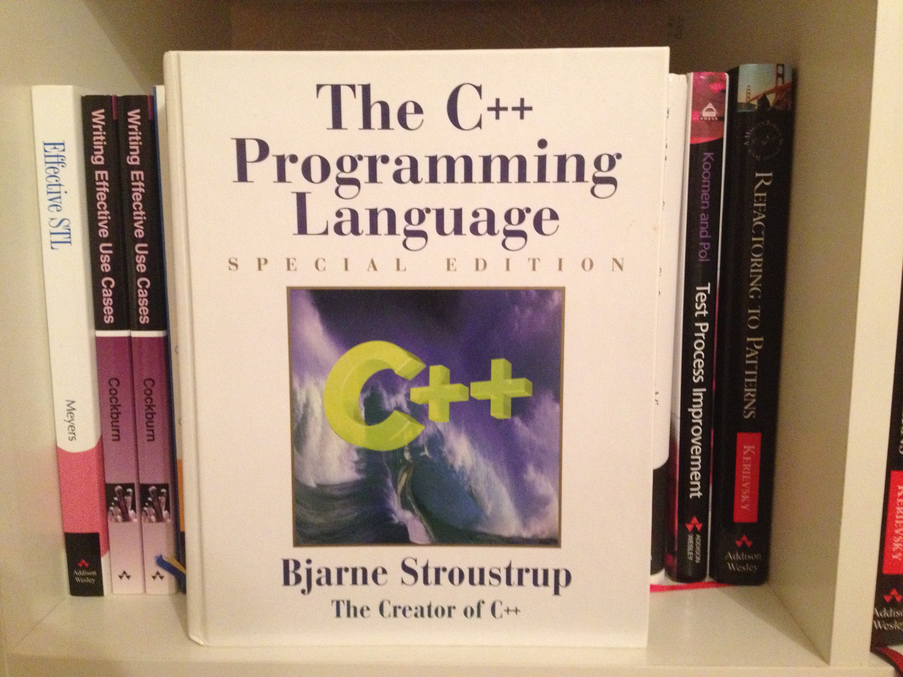
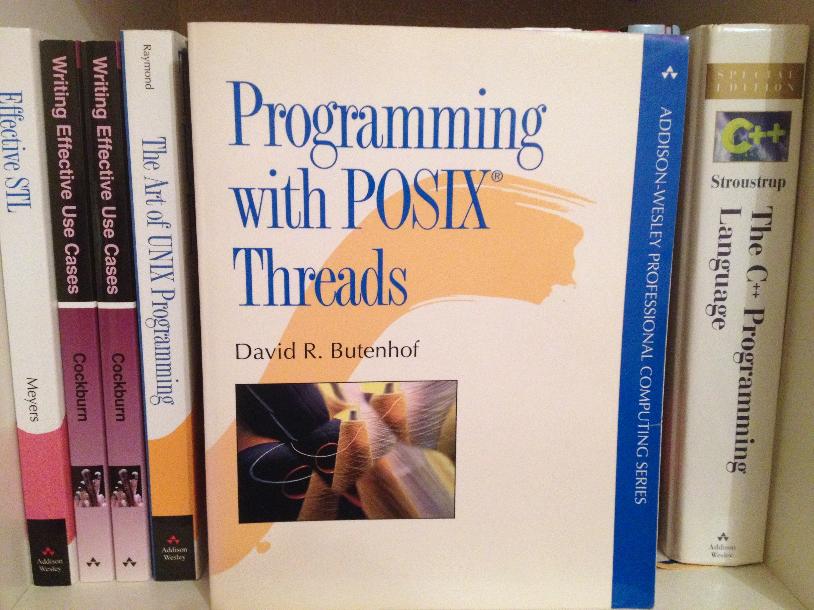
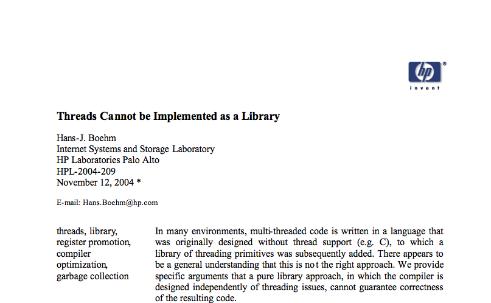

# Introducing the C++ Memory Model


<p>
  <small>by <a href="http://meekrosoft.wordpress.com">Mike Long</a> / <a href="http://twitter.com/meekrosoft">@meekrosoft</a></small>
</p>

Note: The memory model is perhaps one of the most valuable but misunderstood changes 
in c++11.  For the first time, c++ programmers have a language contract with the 
runtime about how their code will be executed in the face of hardware
 optimizations, memory hierarchies and multiple threads of execution.
This talk will introduce you to the key concepts in the memory model, and show how 
these concepts apply to the new atomic primitives in c++11.
<!-- 
Extensions : 
 - whose volatile is it anyway
 _ http://www.open-std.org/JTC1/sc22/wg21/docs/papers/2006/n2016.html
 - compare and swap
 - Store delays
-->
</section>

+++++++++


## Why C++?


<small>http://en.wikipedia.org/wiki/Bjarne_Stroustrup</small>

---------

## Simula
> The poor run-time characteristics were a function of the language and its implementation
rather than a function of the application. The overhead problems were fundamental to Simula
and could not be remedied

<small>A History of C++: 1979-1991, Bjarne Stroustrup</small>

---------

## BCPL
> I re-wrote the simulator in BCPL and ran it on the experimental
CAP computer. The experience of coding and debugging the simulator in BCPL was horrible.
BCPL makes C look like a very high level language

---------

## C with classes
> Stroustrup wanted to write efficient systems programs in the styles encouraged by Simula67. To do that, he added facilities for better type checking, data abstraction, and object-oriented programming to C. The more general aim was to design a language in which developers could write programs that were **both efficient and elegant**. Many languages force you to choose between those two alternatives.

<small>http://isocpp.org/wiki/faq/big-picture#why-invented, emphasis added</small>

---------

>C++ was designed for applications that had to work under the most stringent constraints of run-time and space efficiency. That was the kind of applications where C++ first thrived: operating system kernels, simulations, compilers, graphics, real-time control, etc. This was done in direct competition with C. Current C++ implementations are a bit faster yet.

<small>http://accu.org/index.php/journals/1356</small>

+++++++++

# *Performance*

+++++++++

## `Performance(1979) != Performance(2004)`

---------

## Performance(1979)
* Simula minus the language overhead
* Only pay for what you use

---------

## Performance(2004)
* Free lunch is over

+++++++++


---------

## Where is the love?
>Although threads usage is very widespread and growing, the basic rules for programming with threads, and particularly for accessing shared variables, have been confusing. Even "experts" have often advocated contradictory approaches.

Hans Boehm, http://www.hpl.hp.com/techreports/2009/HPL-2009-259html.html

+++++++++

## Where are the threads?


Note: How does C++03 do multithreading? No threads, No shared memory, No ordering guarantees for memory operations

The language has no threading knowledge
Implemented in libraries (pthreads, windows api)
Compilers are unaware of threads
Compilers can perform transformations that do no preserve the meaning of multithreaded applications (such as reordering)
treat synchronization primitives as opaque and potentially modifying and shared location


+++++++++

## Over here!


+++++++++

## Threading implemented as a library
> Parallel processors are becoming more common, but so are amazingly fast single-processors. ... In addition, networking (both WAN and LAN) imposes its own demands. Because of this diversity I recommend parallelism be represented by libraries within C++ rather than as a general language feature. ... It is possible to design concurrency support libraries in C++ that approaches built-in concurrency support in both convenience of use and efficiency.

http://accu.org/index.php/journals/1356, 1993

+++++++++

## Threading cannot be Implemented as a library

+++++++++



+++++++++

# Re-ordering Rules

* What we sometimes forget...
  * Code is frequently not executed in the order it is written
  * Out-of-order execution invisible to a thread can be visible to external threads
  * Can be reordered by:
    * The compiler
    * The processor
    * The memory subsystem 

+++++++++

# As-if


+++++++++


## This: 

````
void Init() {
  _data = 42;
  _initialized = true;
}
````
<div>
## Could just as easily be reordered like this:

````
void Init() {
  _initialized = true;
  _data = 42;
}
````
</div> <!-- .element: class="fragment" data-fragment-index="2" -->

+++++++++

## Quiz time!

<pre><code class="cpp">
struct s { char a; char b; } x;
// T1:          // T2:
x.a = 1;        x.b = 1;
</code></pre>

Can the compiler transform T1 to this?

````
struct s tmp = x;
tmp.a = 1;
x = tmp;
````
### Yes. Compiler transformations can introduce new writes. <!-- .element: class="fragment" data-fragment-index="2" -->


+++++++++

## Quiz time!

<pre><code class="cpp">
// T1:                    // T2:
r1=X                      r2=Y
if (r1==1)                if (r2==1)
   Y=1                      X=1

</code></pre>

Is outcome r1=r2=1 allowed?

### Yes, because of speculative branching. <!-- .element: class="fragment" data-fragment-index="2" -->

+++++++++

## And that is just the beginning
* Hardware:
   * Out of order execution
   * Pipelining
   * hardware threads
   * instruction cache, data cache, store buffer
   * speculative execution and prediction
   
* Compiler:
   * Re-ordering
   * Register promotion

+++++++++

# Yikes!

+++++++++

<section data-background="#007777">
# The C++ memory model
<p> </p>
Note: This note makes the layout correct! Wow, Magic!
</section>

+++++++++

## What is it?


* A contract with the machine architects and compiler writer with you <!-- .element: class="fragment" data-fragment-index="2" -->
* Data-race-free <!-- .element: class="fragment" data-fragment-index="3" -->
 
Note: .a.k.a. Properly labeled or within-thread as-if-serial
.do not contain data races in any sequentially consistent execution
.undefined semantics in the presence of a data race
.the programmer is responsible for synchronization

+++++++++

## The new C++ abstract machine


* Semantics of concurrent operations at an abstract level
  * how memory reads and writes may be executed by a processor relative to their program order
  * how writes by one processor may become visible to other processors
  
+++++++++

<pre><code class="cpp"> 
           // Global
           int x, y;
// Thread 1         // Thread 2
x = 17;             cout << y << " ";
y = 37;             cout << x << endl;
</code></pre>
What does this program output?

* Meaningless question in C++03 <!-- .element: class="fragment" data-fragment-index="2" -->
* Undefined Behavior in C++11 <!-- .element: class="fragment" data-fragment-index="3" -->
* ...and this is an improvement! <!-- .element: class="fragment" data-fragment-index="4" -->

+++++++++

<section data-background="#007777">
## `-std=c++11`
<p></p>
Note: This makes the layout correct
</section>
+++++++++

<pre><code class="cpp"> 
// Thread 1: 
{
  std::lock_guard&lt;std::mutex&gt; lg(m);
  x = 17;
  y = 37;
}
// Thread 2:
{
  std::lock_guard&lt;std::mutex> lg(m);
  cout << y << " ";
  cout << x << endl;
}
</code></pre>

* Defined behavior in C++11 <!-- .element: class="fragment" data-fragment-index="2" -->
* Result can be <!-- .element: class="fragment" data-fragment-index="3" --> `'0 0' or '37 17'` <!-- .element: class="fragment" data-fragment-index="4" -->

+++++++++

## But is adding mutex the answer?

* Pros: 
	* acq/rel enforce ordering
	* familiar
* Cons: <!-- .element: class="fragment" data-fragment-index="2" -->
    * deadlocks, livelocks, races <!-- .element: class="fragment" data-fragment-index="2" -->
    * coarse-grained <!-- .element: class="fragment" data-fragment-index="2" -->
    * sometimes overly restrictive <!-- .element: class="fragment" data-fragment-index="2" -->
     
<p>And wouldn`t it be nice if we could just tag the variable (not everywhere it is used)?</p> <!-- .element: class="fragment" data-fragment-index="3" -->


+++++++++

<section data-background="#007777">
## `<std::atomic>`
<p></p>
Note: This makes the layout correct
</section>
+++++++++
<pre><code class="cpp">
      // Global
      atomic&lt;int> x, y;

// Thread 1      // Thread 2
x.store(17);     cout << y.load() << " ";
y.store(37);     cout << x.load() << endl;
</code></pre>

* Defined behavior in C++11 <!-- .element: class="fragment" data-fragment-index="2" -->
* Result can be <!-- .element: class="fragment" data-fragment-index="3" --> `'0 0', '37 17', or '0 17'` <!-- .element: class="fragment" data-fragment-index="4" -->

Note: Now what does that give us?  What we don't see here is the default memory ordering for atomics.
+++++++++

# Sequential Consistency
(`std::memory_order_seq_cst`)


````
// Thread 1
x.store(17);
y.store(37);
````

+++++++++

# Sequential Consistency
(`std::memory_order_seq_cst`)


````
// Thread 1
x.store(17, memory_order_seq_cst);
y.store(37, memory_order_seq_cst);

````
 * <!-- .element: class="fragment" data-fragment-index="2" --> *Atomicity* <!-- .element: class="fragment" data-fragment-index="2" -->
 * <!-- .element: class="fragment" data-fragment-index="3" -->*Ordering* <!-- .element: class="fragment" data-fragment-index="3" -->

+++++++++

# Memory orders

<pre><code class="cpp">
namespace std {
	typedef enum memory_order {
		memory_order_relaxed, 
		memory_order_consume,
		memory_order_acquire,
		memory_order_release,
		memory_order_acq_rel,
		memory_order_seq_cst
	} memory_order;
}
</code></pre>

+++++++++

# Relaxed atomics
(`std::memory_order_relaxed`)


Now we have:

 * <!-- .element: class="fragment" data-fragment-index="2" --> *Atomicity* <!-- .element: class="fragment" data-fragment-index="2" -->
 * <!-- .element: class="fragment" data-fragment-index="3" -->*Absolutely no ordering guarantees	* <!-- .element: class="fragment" data-fragment-index="3" -->

(Still following the as-if rule) <!-- .element: class="fragment" data-fragment-index="3" -->

+++++++++

<pre><code class="cpp">
            // Global
        atomic&lt;int> x, y;

          // Thread 1          
x.store(17,memory_order_relaxed);   
y.store(37,memory_order_relaxed);   

          // Thread 2
cout << y.load(memory_order_relaxed) << " ";
cout << x.load(memory_order_relaxed) << endl;
</code></pre>

* Result can be <!-- .element: class="fragment" data-fragment-index="3" --> `'0 0', '37 17', '0 17' or '37 0'` <!-- .element: class="fragment" data-fragment-index="4" -->

Note: Now we are in a brave new world of relaxed atomics!

+++++++++

# Release and Acquire

<pre><code class="cpp">
namespace std {
	typedef enum memory_order {
		memory_order_relaxed, 
		memory_order_consume,
		memory_order_acquire,
		memory_order_release,
		memory_order_acq_rel,
		memory_order_seq_cst
	} memory_order;
}
</code></pre>

+++++++++

# Release and Acquire
(`std::memory_order_release`, `std::memory_order_acquire`)

* Release semantics: 
  * prevent memory reordering of preceding operations
* Acquire semantics: 
  * prevent memory reordering of following operations
* can move operations prior to locked section into critical section
* can move operations following locked section into critical section
* Establishes a *happens-before* relationship

+++++++++

<pre><code class="cpp">
std::atomic&lt;std::string*> ptr;
int data;

void producer()
{
  std::string* p = new std::string("Hello");
  data = 42;
  ptr.store(p, std::memory_order_release);
}

void consumer()
{
    std::string* p2;
    while (!(p2 = ptr.load(std::memory_order_acquire)))
        ;
    assert(*p2 == "Hello"); // never fails
    assert(data == 42);     // never fails
}
</code></pre>

+++++++++

## Release and Acquire Relationships

* *sequenced-before* relationship established by:
   * Good ol' fashioned sequence points (ST)
* *happens-before* relationship established by:
   * Program order (in single-threaded context)
   * *synchronizes-with* relationship (in multi-threaded context)
* *synchronizes-with* relationship established by:
   * Mutex lock/unlock
   * Thread create/join
   * Acquire & release semantics (atomic<> and fences)

+++++++++

# Consume

<pre><code class="cpp">
namespace std {
	typedef enum memory_order {
		memory_order_relaxed, 
		memory_order_consume,
		memory_order_acquire,
		memory_order_release,
		memory_order_acq_rel,
		memory_order_seq_cst
	} memory_order;
}
</code></pre>

+++++++++

# Consume
(`std::memory_order_consume`)

* Limits the synchronized data to direct dependencies
* Establishes a *dependency-ordered-before* relationship

+++++++++
<pre><code class="cpp">
std::atomic&ltstd::string*> ptr;
int data;
 
void producer()
{
    std::string* p  = new std::string("Hello");
    data = 42;
    ptr.store(p, std::memory_order_release);
}
 	
void consumer()
{
    std::string* p2;
    while (!(p2 = ptr.load(std::memory_order_consume)))
        ;
    assert(*p2 == "Hello"); // never fires
    assert(data == 42); // may or may not fire
}
</code></pre>
+++++++++

## Consume Relationships

* *carries-a-dependency-to* relationship established by:
   * data dependency between operations (transitive, ST)
* *dependency-ordered-before* relationship established by:
   * Consume semantics

+++++++++

<section data-background="#007777">
## `presentation.join()`
(conclusions)
<p></p>
Note: This makes the layout correct
</section>

+++++++++

## Weak atomics are tricky!


> Any time you deviate from sequential consistency, you increase the complexity of the problem by orders of magnitude.

+++++++++

## Perhaps more than tricky?


>I had no idea what I was getting myself into when attempting to reason about C++ weak atomics. The theory behind them is so complex that it's borderline unusable. It took three people (Anthony, Hans, and me) and a modification to the Standard to complete the proof of a relatively simple algorithm. Imagine doing the same for a lock-free queue based on weak atomics!

+++++++++

# This has always been available
* At a low level
* non-portable
* non-standard way


+++++++++

# <div color="red">Programmability</div> <!-- .element: class="fragment highlight-green" data-fragment-index="0"--> `vs` *Performance*
(Stronger guarantees for programmers vs. Greater flexibility to reorder memory operations)

Also affects portability and performance by constraining the transformation that can occur.

+++++++++

# The free lunch ain't dead
## ...it just smells funny <!-- .element: class="fragment" data-fragment-index="2" -->
 <!-- .element: class="fragment" data-fragment-index="2" -->

+++++++++

# Thanks!

+++++++++

# Reading list

<small>
Foundations of the C++ Concurrency Memory Model, 
Hans-J. Boehm, Sarita V. Adve:
http://www.hpl.hp.com/techreports/2008/HPL-2008-56.pdf

std::memory_order explanations:
http://en.cppreference.com/w/cpp/atomic/memory_order

Memory barriers in the linux kernel:
https://www.kernel.org/doc/Documentation/memory-barriers.txt

Memory orders at compile time:
http://preshing.com/20120625/memory-ordering-at-compile-time/

C++ atomics and memory ordering:
http://bartoszmilewski.com/2008/12/01/c-atomics-and-memory-ordering/

Speculative memory promotion:
http://aggregate.org/LAR/p125-lin.pdf

N1525: Memory-Order Rationale
http://www.open-std.org/jtc1/sc22/wg14/www/docs/n1525.htm
</small>
+++++++++

# Credits
<small>
http://en.wikipedia.org/wiki/Door_to_Hell
http://en.wikipedia.org/wiki/File:Threadsmoviecover.jpg
http://en.wikipedia.org/wiki/File:Handshake_(Workshop_Cologne_%2706).jpeg
http://www.flickr.com/photos/heiner1947/4395120961/in/faves-24788065@N02/
</small>